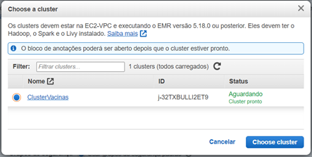
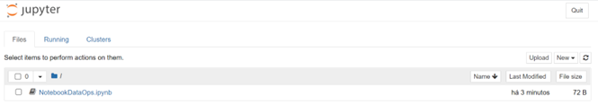
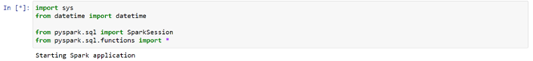
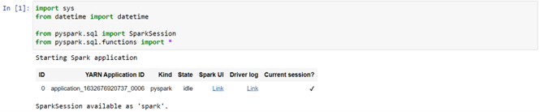

# DataOps - Laboratório 8

Entrega e Visualização

As instruções do laboratório estão em português. Para alterar o idioma, procure a opção na barra inferior do console AWS.

## Objetivos

* Utilizar o Jupyter Notebook com EMR para criar gráficos de visualização
* Disponibilizar uma API para retornar dados do Redshift
* Disponibilizar uma aplicação estática no S3 para consumir a API e mostrar gráficos

## Criar, testar e executar pyspark com Jupyter Notebook no EMR

Quando criamos o cluster do EMR no [Laboratório 7](https://github.com/fesousa/dataops-lab7) incluimos a instalação do Jupyter Notebook e do apache Livy. Com eles é possível criar tarefas de ETL usando o pyspark, executando no cluster EMR e trabalhar com visualização dos dados utilizando bibliotecas do python, como matplotlib, seaborn, chartify, etc, tudo isso a partir no Jupyter Notebook

1. Crie novamente o cluster EMR do [Laboratório 7](https://github.com/fesousa/dataops-lab7)

2. No console do EMR da AWS procure e clique em  no menu do lado esquerdo

3. Clique em 

4.	Configure os seguintes campos:

    4.1. Nome do bloco de anotações: NotebookDataOps

    4.2. Cluster: clique em  e escolha o cluster criado neste laboratório

    

    4.3. Função de serviço da AWS: escolha `LabRole`

    4.4 Clique em 

5. Espere o notebook iniciar e clique em 

6. Conectado no Jupyter Notebook você verá a seguinte tela:

7. Na tela inicial do Jupyter notebook crie um novo arquivo clicando em  e depois em 

8. Uma nova janela com um notebook do Jupyter será aberta. Nele é possível criar códigos em python em pequenos blocos, executando separadamente assim evita o reprocessamento de etapas quando estamos testando as análises. Os códigos criados no notebook EMR são automaticamente salvos no S3. É possível configurar um repositório Git (tente fazer como desafio...)

9. Identifique a célula onde são escritos os códigos python e pyspark. Ele parece com o da imagem abaixo. 

10. Copie as importações do arquivo spark-etl-vacinas.py, do VSCode (código está logo abaixo) e cole na área cinza da célula do notebook. Depois, aperte o botão  para executar.

https://github.com/fesousa/dataops-lab8/blob/96d55034e8639f95508051927acdaadd4543a760/code/imports.py#L1-L5

11.	A execução termina quando o `*` dentro dos colchetes (`[]`) ao lado esquerdo da célula é trocado por um número, que identifica o número da execução na sessão do notebook. Quando finalizar, você deve ver um resultado como como o da segunda imagem abaixo (Execução finalizada)

Célula em execução

Execução finalizada

12.	Repare que uma nova célula foi criada automaticamente. Nela será escrito o próximo código que se deseja executar. O interessante do Jupyter notebook é que o que foi escrito e executado em uma célula (importações, variáveis, funções, classes, etc) pode ser utilizado em qualquer outra célula, evitando assim a reexecução de todo o código quando apenas uma pequena parte foi modificada.

Além disso, como criamos um notebook do tipo pyspark, uma variável chamada `spark` foi criada, e poderá ser utilizada em qualquer outra célula. Ela contém a sessão do spark, e substitui a seguinte linha de código utilizada diretamente no spark do EMR:

https://github.com/fesousa/dataops-lab8/blob/3de56ffa93ad23a4fafb0e0b2af8072f3f5d5992/code/sessao_spark.py#L1-L2

13.	Na segunda célula (a que ainda está vazia, sem nenhum código), crie duas variáveis para armazenar os caminhos dos buckets de entrada e saída do ETL. Lembre-se de trocar `<nome-bucket>` pelo que bucket onde estão seus dados. Depois execute a nova célula. As duas variáveis criadas (`input_path` e `output_path`) agora podem ser utilizadas em qualquer outra célula do notebook. Uma nova célula será aberta.

https://github.com/fesousa/dataops-lab8/blob/ffa0b7f3e180bc313a2a71c10fd8824027735a7a/code/buckets.py#L1-L2

14.	Na terceira célula faça a leitura dos dados do bucket de entrada (`input_path`) para uma variável `vacinas`. Essa nova variável poderá ser utilizada nas próximas células para continuar o ETL. Execute a célula para a leitura dos dados.

https://github.com/fesousa/dataops-lab8/blob/d7e968e788fc60a8a5d2ce83a4373768c4184c5c/code/read_data.py#L1-L2

15.	Quando a célula terminar a execução, os dados dos arquivos do bucket de entrada estarão disponíveis na variável vacinas, em um objeto parecido com o `DataFrame` do `pandas`. Qualquer tipo de análise, transformação e visualização nos dados poderá ser feita agora com `pyspark`

16.	Execute algumas análises com comandos básicos do pandas e do pyspark. Cada umas das análises abaixo você deverá fazer um uma célula diferente, assim consegue ver os resultados parciais, sem precisar recarregar os dados

    16.1. Quantidade de registros:

    https://github.com/fesousa/dataops-lab8/blob/96564222873c57c4df21c0e8f7c0059cf333255c/code/count.py#L1

    16.2.Mostrar dados

    https://github.com/fesousa/dataops-lab8/blob/96564222873c57c4df21c0e8f7c0059cf333255c/code/show.py#L1

    16.3. Mostrar schema dos dados

    https://github.com/fesousa/dataops-lab8/blob/b9db0471699e4ec39ff0e6958942fd28ef5a3c0d/code/schema.py#L1

    16.4. Contar quantidade de vacinas por nome

    https://github.com/fesousa/dataops-lab8/blob/b9db0471699e4ec39ff0e6958942fd28ef5a3c0d/code/count_nome.py#L1-L2

    16.5. Mostrar um gráfico de distribuição pode nome da vacina

    https://github.com/fesousa/dataops-lab8/blob/1d8655755a0a32ff832d0c9157a2788f4985a163/code/chart_nome.py#L1-L13

17.	Tente sozinho: crie células para completar o ETL executado dentro do EMR (consulte o [Laboratório 7](https://github.com/fesousa/dataops-lab7)), mas agora no notebook do EMR. As etapas que faltam são:

    a.	Transformar a coluna de dose da vacina

    b.	Remover colunas desnecessárias

    c.	Renomear colunas

    d.	Agrupar e contar registros

    e.	Salvar parquet no S3

## Finalização do Laboratório

Termine o cluster do EMR para economizar recursos da sua conta.

    &copy; 2022 Fernando Sousa
     
    
Last update: 2022-05-07 19:16:57

