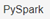

# DataOps - Laboratório 8

Entrega e Visualização

As instruções do laboratório estão em português. Para alterar o idioma, procure a opção na barra inferior do console AWS.

## Objetivos

* Utilizar o Jupyter Notebook com EMR para criar gráficos de visualização
* Disponibilizar uma API para retornar dados do Redshift
* Disponibilizar uma aplicação estática no S3 para consumir a API e mostrar gráficos

## Criar, testar e executar pyspark com Jupyter Notebook no EMR

Quando criamos o cluster do EMR no [Laboratório 7](https://github.com/fesousa/dataops-lab7) incluimos a instalação do Jupyter Notebook e do apache Livy. Com eles é possível criar tarefas de ETL usando o pyspark, executando no cluster EMR e trabalhar com visualização dos dados utilizando bibliotecas do python, como matplotlib, seaborn, chartify, etc, tudo isso a partir no Jupyter Notebook

1. Crie novamente o cluster EMR do [Laboratório 7](https://github.com/fesousa/dataops-lab7)

2. No console do EMR da AWS procure e clique em  no menu do lado esquerdo

3. Clique em 

4.	Configure os seguintes campos:

    4.1. Nome do bloco de anotações: NotebookDataOps

    4.2. Cluster: clique em  e escolha o cluster criado neste laboratório

    

    4.3. Função de serviço da AWS: escolha `LabRole`

    4.4 Clique em 

5. Espere o notebook iniciar e clique em 

6. Conectado no Jupyter Notebook você verá a seguinte tela:

7. Na tela inicial do Jupyter notebook crie um novo arquivo clicando em  e depois em 

8. Uma nova janela com um notebook do Jupyter será aberta. Nele é possível criar códigos em python em pequenos blocos, executando separadamente assim evita o reprocessamento de etapas quando estamos testando as análises. Os códigos criados no notebook EMR são automaticamente salvos no S3. É possível configurar um repositório Git (tente fazer como desafio...)

9. Identifique a célula onde são escritos os códigos python e pyspark. Ele parece com o da imagem abaixo. 

10. Copie as importações do arquivo spark-etl-vacinas.py, do VSCode (código está logo abaixo) e cole na área cinza da célula do notebook. Depois, aperte o botão para executar.

https://github.com/fesousa/dataops-lab8/blob/96d55034e8639f95508051927acdaadd4543a760/code/imports.py#L1-

## Finalização do Laboratório

Termine o cluster do EMR para economizar recursos da sua conta.

    &copy; 2022 Fernando Sousa
     
    
Last update: 2022-04-03 16:09:11

